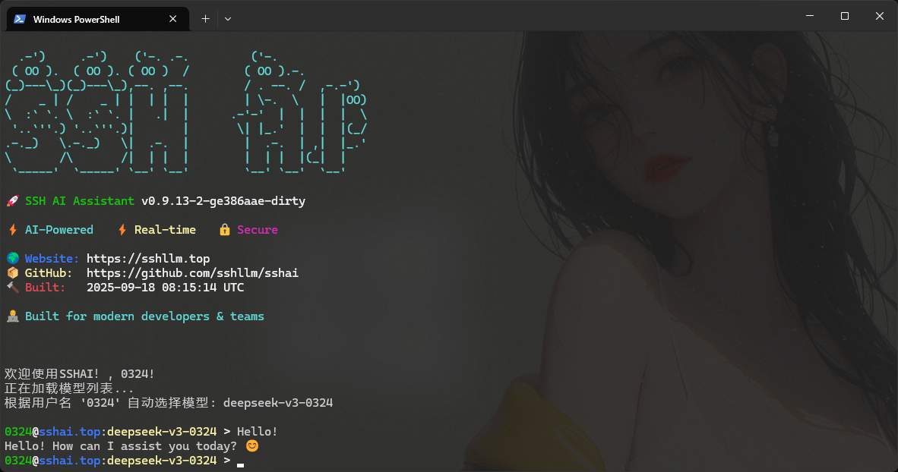

# SSHAI - SSH AI Assistant

[English](./README_EN.md) | 简体中文

一个通过SSH连接提供AI模型服务的智能助手程序，让你可以在任何支持SSH的环境中使用AI助手。

## 🚀 立即体验
打开你的终端，输入如下命令即可立即体验在线AI服务！
```bash
ssh test.sshai.top -p 9527
```



## ✨ 主要特性

- 🔐 **SSH安全连接** - 通过SSH协议提供加密的AI服务访问
- 🔑 **灵活认证** - 支持密码认证和无密码模式
- 🤖 **多模型支持** - 支持DeepSeek、Hunyuan等多种AI模型
- 💭 **实时思考显示** - 支持DeepSeek R1等模型的思考过程实时展示
- 🎨 **美观界面** - 彩色输出、动画效果和ASCII艺术
- ⚙️ **灵活配置** - 完整的YAML配置文件支持
- 🌐 **多语言支持** - 支持中文和英文界面
- 📝 **自定义提示词** - 可配置的AI提示词系统
- 🏗️ **模块化设计** - 清晰的代码架构，易于扩展

## 🚀 快速开始

### 1. 下载和编译

```bash
# 克隆项目
git clone https://github.com/sshllm/sshai.git
cd sshai

# 编译程序
make build
# 或者
go build -o sshai cmd/main.go
```

### 2. 配置设置

编辑 `config.yaml` 文件，设置你的API密钥：

```yaml
# API配置
api:
  base_url: "https://api.deepseek.com/v1"
  api_key: "your-api-key-here"
  default_model: "deepseek-v3"

# 服务器配置
server:
  port: 2213
  welcome_message: "欢迎使用SSHAI！"

# 认证配置（可选）
auth:
  password: ""  # 留空=无密码认证
  login_success_message: |
    🎉 认证成功！欢迎使用 SSHAI
    📖 项目地址: https://github.com/sshllm/sshai

# 自定义提示词配置
prompt:
  system_prompt: "你是一个专业的AI助手，请用中文回答问题。"
  stdin_prompt: "请分析以下内容并提供相关的帮助或建议："
  exec_prompt: "请回答以下问题或执行以下任务："
```

### 3. 运行服务器

```bash
# 直接运行
./sshai

# 后台运行
./sshai > server.log 2>&1 &

# 使用脚本运行
./scripts/run.sh
```

### 4. 连接使用

```bash
# 交互模式
ssh user@localhost -p 2213

# 直接执行命令
ssh user@localhost -p 2213 "你好，请介绍一下你自己"

# 管道输入分析
cat file.txt | ssh user@localhost -p 2213
echo "分析这段代码" | ssh user@localhost -p 2213
```

## 📁 项目结构

```
sshai/
├── README.md              # 中文说明文档
├── README_EN.md           # 英文说明文档
├── LICENSE                # 开源协议
├── config.yaml           # 主配置文件
├── config-en.yaml        # 英文配置文件
├── go.mod                # Go模块依赖
├── Makefile              # 构建脚本
├── cmd/                  # 程序入口
│   └── main.go           # 主程序文件
├── pkg/                  # 核心模块
│   ├── config/           # 配置管理
│   ├── models/           # 数据模型
│   ├── ai/               # AI助手功能
│   ├── ssh/              # SSH服务器
│   └── utils/            # 工具函数
├── docs/                 # 项目文档
├── scripts/              # 测试和运行脚本
└── keys/                 # SSH密钥文件
```

## 🔧 配置指南

### API配置

支持多个API端点配置：

```yaml
api:
  base_url: "https://api.deepseek.com/v1"
  api_key: "your-deepseek-key"
  default_model: "deepseek-v3"
  timeout: 600

# 可配置多个API
api_endpoints:
  - name: "deepseek"
    base_url: "https://api.deepseek.com/v1"
    api_key: "your-key"
    default_model: "deepseek-v3"
  - name: "local"
    base_url: "http://localhost:11434/v1"
    api_key: "ollama"
    default_model: "gemma2:27b"
```

### 认证配置

```yaml
auth:
  password: "your-secure-password"  # 设置访问密码
  login_prompt: "请输入访问密码: "
  login_success_message: |
    🎉 认证成功！
    欢迎使用 SSHAI AI 助手
```

### 提示词配置

```yaml
prompt:
  system_prompt: "你是一个专业的AI助手..."
  stdin_prompt: "请分析以下内容："
  exec_prompt: "请回答以下问题："
```

## 🧪 测试

项目包含完整的测试脚本：

```bash
# 基础功能测试
./scripts/test.sh

# SSH执行功能测试
./scripts/test_ssh_exec_final.sh

# 标准输入功能测试
./scripts/test_stdin_feature.sh

# 认证功能测试
./scripts/test_auth.sh

# DeepSeek R1思考模式测试
./scripts/test_deepseek_r1.sh
```

## 📚 文档

- [配置指南](docs/CONFIG_GUIDE.md) - 详细的配置说明
- [使用指南](docs/USAGE.md) - 功能介绍和使用方法
- [架构说明](docs/MODULAR_ARCHITECTURE.md) - 模块化架构设计
- [认证配置](docs/AUTH_CONFIG_EXAMPLE.md) - SSH认证配置示例

## 🤝 贡献

欢迎提交Issue和Pull Request！

1. Fork 项目
2. 创建功能分支 (`git checkout -b feature/AmazingFeature`)
3. 提交更改 (`git commit -m 'Add some AmazingFeature'`)
4. 推送到分支 (`git push origin feature/AmazingFeature`)
5. 打开Pull Request

## 📄 许可证

本项目采用个人使用许可证，允许个人和教育用途，不允许商业使用。详情请查看 [LICENSE](LICENSE) 文件。

## 🙏 致谢

感谢所有为这个项目做出贡献的开发者和用户！

---

**注意**: 本项目仅供个人学习和研究使用，商业使用请联系项目维护者获取商业许可。